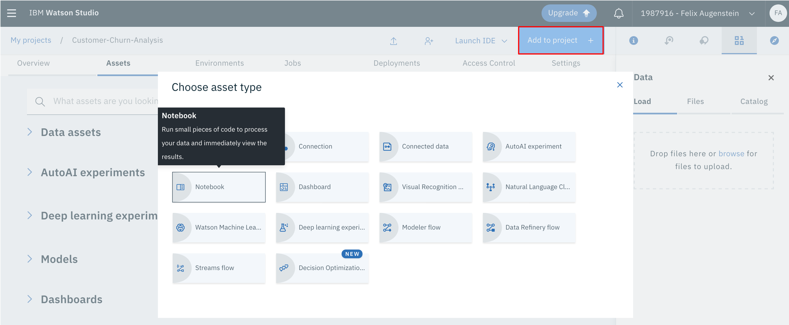
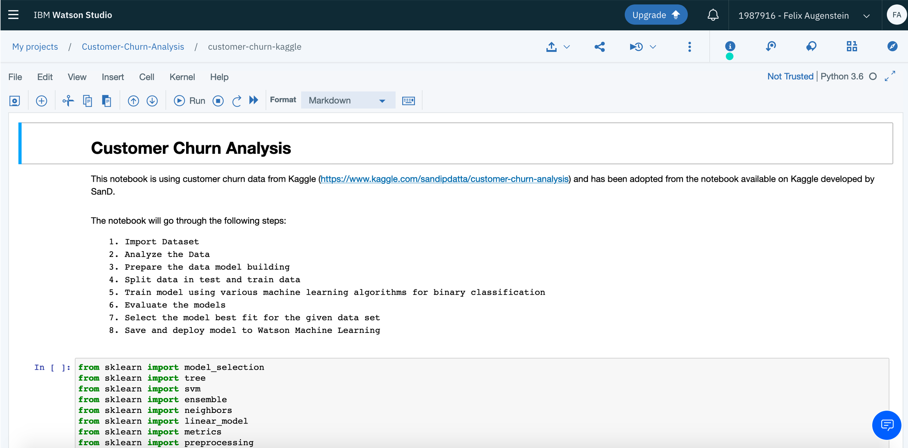
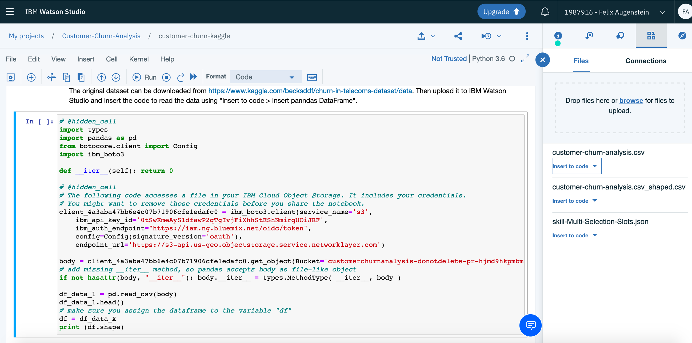
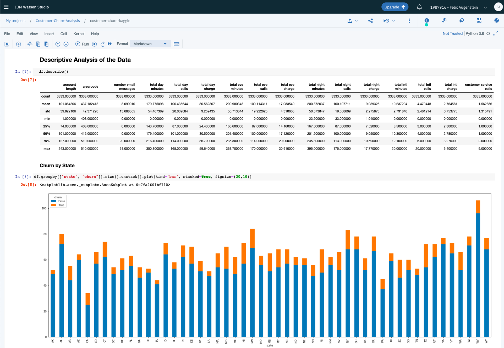
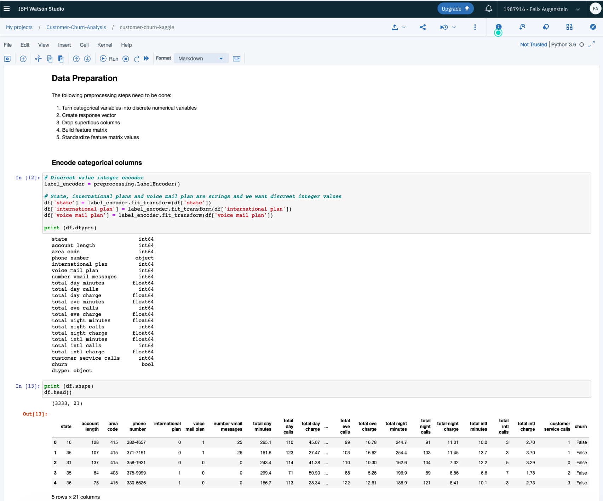
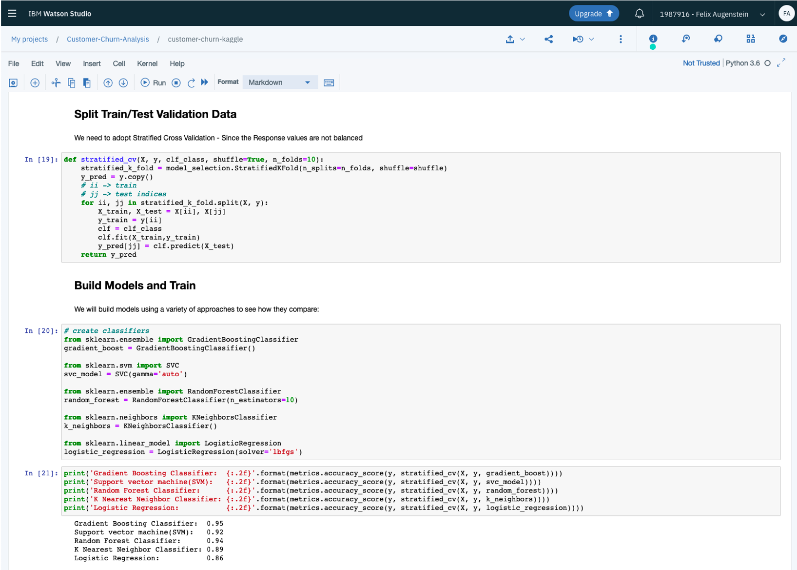
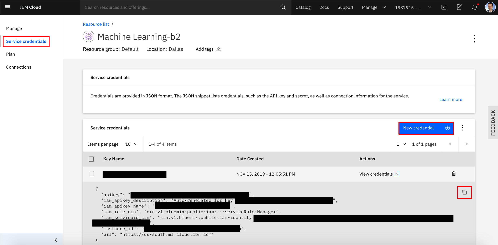
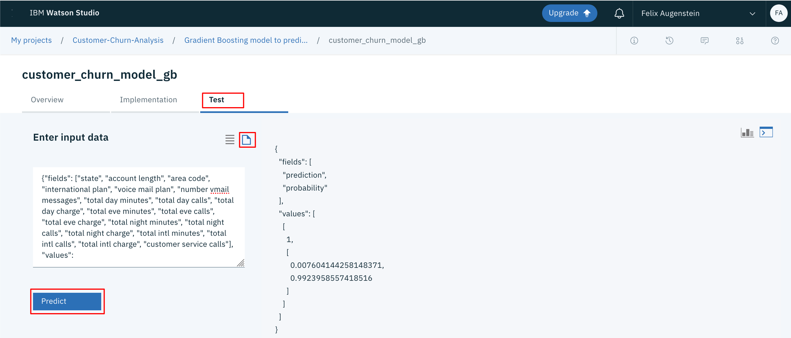

<h1 align="center" style="border-bottom: none;">:bar_chart: Introduction to Machine Learning and Watson Studio </h1>
<h3 align="center">In this hands-on tutorial you will perform data visualization, preparation, and transformation to build a high-quality predictive model for customer churn.</h3>

This tutorial is an updated version of the [IBM Digital Tech Tutorial: Watson Studio](https://github.com/FelixAugenstein/digital-tech-tutorial-watson-studio), which is based on the [Learning path: Getting started with Watson Studio](https://developer.ibm.com/series/learning-path-watson-studio/). Credits and aprreciation to my IBM colleague Felix Augenstein.

## Prerequisites

1. Sign up for an [IBM Cloud account](https://ibm.biz/hsg-cloud).
2. Fill in the required information and press the „Create Account“ button.
3. After you submit your registration, you will receive an e-mail from the IBM Cloud team with details about your account. In this e-mail, you will need to click the link provided to confirm your registration.
4. Now you should be able to login to your new IBM Cloud.

## Digital Tech Tutorial Watson Studio Part I to IV

This tutorial consists of 4 parts, you can start with part I or any other part, however, the necessary environment is set up in part I.<br>
[Part I - data visualization, preparation, and transformation](https://github.com/you-R-I/Workshop_Watson-Studio-ICP4D-Part1)<br>
[Part II - build and evaluate machine learning models by using the AutoAI](https://github.com/you-R-I/Workshop_Watson-Studio-ICP4D-Part2)<br>
[Part III - graphically build and evaluate machine learning models by using the SPSS Modeler flow](https://github.com/you-R-I/Workshop_Watson-Studio-ICP4D-Part3)<br>
[Part IV - set up and run Jupyter Notebooks to develop a machine learning model](https://github.com/you-R-I/Workshop_Watson-Studio-ICP4D-Part4)


## Create the first Jupyter Notebook

Create a Jupyter Notebook for predicting customer churn and change it to use the data set that you have uploaded to the project.

1. In the Asset tab, click Add to Project.



2. Select the Notebook asset type.
3. On the New Notebook page, configure the notebook as follows:

- Select From file tab and upload the customer-churn-kaggle.ipynb file from this repository.
- Enter the name for the notebook (for example, ‘customer-churn-kaggle’).
- Select the Python 3.6 runtime system.
- Click Create Notebook. This initiates the loading and running of the notebook within IBM Watson Studio.


## Run the notebook

The notebook page should now be displayed. If the notebook is not currently open, you can start it by clicking the Edit icon displayed next to the notebook in the Asset page for the project. The notebook should look like this:



From the notebook page, make the following changes:

1. Scroll down to the third cell, and select the empty line in the middle of the cell. If not already open, click the 1001 data icon at the upper part of the page to open the Files subpanel.


2. In the right part of the page, select the Customer Churn .csv data set. Click insert to code, and select Insert pandas DataFrame. This adds code to the data cell for reading the data set into a pandas DataFrame.

Afterwards your Jupyter Notebook should look like this:



3. Make sure you assign the dataframe to the variable "df". Therefore change the variable `df_data_X` to, for instance, `df_data_1` depending on your generated variable. When you execute cell 4 in the notebook, the data frame appears as the following:


4. Select File > Save to save the notebook.

<h3>Background on running Jupyter Notebooks</h3>

When a notebook is run, each code cell in the notebook is executed, in order, from top to bottom.

Each code cell is selectable and is preceded by a tag in the left margin. The tag format is In [x]:. Depending on the state of the notebook, the x can be:

- A blank, which indicates that the cell has never been run
- A number, which represents the relative order that this code step was run
- An *, which indicates that the cell is running

There are several ways to run the code cells in your notebook:

- One cell at a time. Select the cell, and then press Play in the toolbar, or use the shortcut on Mac `Shift + Enter`.
- Batch mode, in sequential order. From the Cell menu, there are several options available. For example, you can Run All cells in your notebook, or you can Run All Below, which starts running from the first cell under the currently selected cell, and then continues running all of the cells that follow.
- At a scheduled time. Press the Schedule button that is located in the upper-right section of your notebook page. Here, you can schedule your notebook to be run once at some future time or repeatedly at your specified interval.

## Data understanding and visualization

During the data understanding phase, the initial set of data is collected. The phase then proceeds with activities that enable you to become familiar with the data, identify data quality problems, and discover first insights into the data. In the Jupyter Notebook, these activities are done using pandas and the embodied `matplotlib` functions of pandas. The `describe` function of pandas is used to generate descriptive statistics for the features, and the `plot` function is used to generate diagrams showing the distribution of the data.

Execute all code cells until cell 8.



## Data preparation

The data preparation phase covers all activities that are needed to construct the final data set that will be fed into the machine learning service. Data preparation tasks are likely to be performed multiple times and not in any prescribed order. Tasks include table, record, and attribute selection as well as transformation and cleansing of data for the modeling tools. In the Jupyter Notebook, this involves turning categorical features into numerical ones, normalizing the features, and removing columns that are not relevant for prediction (such as the phone number of the client). The following image shows a subset of the operations.

Execute all code cells until cell 13.



## Modeling and evaluation

In the modeling phase, various modeling techniques are selected and applied and their parameters are calibrated to achieve an optimal prediction. Typically, there are several techniques that can be applied, and some techniques have specific requirements on the form of the data. Therefore, going back to the data preparation phase is often necessary. However, in the model evaluation phase, the goal is to build a model that has high quality from a data analysis perspective. Before proceeding to final deployment of the model, it’s important to thoroughly evaluate it and review the steps that are executed to create it to be certain that the model properly achieves the business objectives.

In the Jupyter Notebook, this involved splitting the data set into training and testing data sets (using stratified cross-validation) and then training several models using distinct classification algorithms such as `GradientBoostingClassifier`, support vector machines, random forest, and K-Nearest Neighbors.

Execute all code cells until cell 21.



Following this step, we continue with printing the confusion matrix for each algorithm to get a more in-depth view of the accuracy and precision offered by the models.

Execute all code cells until cell 25.


Optional: Execute all code cells until cell 27.

## Deploying your model to Watson Machine Learning

In the last section of the notebook, we save and deploy the model to the Watson Machine Learning service. To access the service, we need to cut and paste the Machine learning credentials. You can find them if you click on your Machine Learning service on your IBM Cloud Dashboard. Then select credentials and copy existing ones or create new ones.



Paste the Machine learning credentials into this notebook cell, behind the variable `wml_credentials` and execute the code cell:


After the model is saved and deployed to Watson Machine Learning, we can access it in a number of ways.

In the Jupypter Notebook, we can pass data to the model scoring endpoint to test it.

Therefore execute all remaining code cells.


Select File > Save to save the notebook.

If we go back to the Watson Studio console, we can see in the Assets tab that the new model is listed in the Models section.


If we click on the Deployments tab, we can see that the model has been successfully deployed.


Click on the deployment to get more details. If you click the Implementation tab, you will see the scoring endpoint. In the Code Snippets section, you can see examples of how to access the scoring endpoint programmatically.

On the Test tab, we can pass in a scoring payload JSON object to score the model (similar to what we did in the notebook). After supplying the data, press Predict to score the model. Use the following JSON Code: 

```
{"fields": ["state", "account length", "area code", "international plan", "voice mail plan", "number vmail messages", "total day minutes", "total day calls", "total day charge", "total eve minutes", "total eve calls", "total eve charge", "total night minutes", "total night calls", "total night charge", "total intl minutes", "total intl calls", "total intl charge", "customer service calls"], "values":[[2,162,415,0,0,0,70.7,108,12.02,157.5,87,13.39,154.8,82,6.97,9.1,3,2.46,4]]}
```



The prediction result is given in terms of the probability that the customer will churn (1/True) or not (0/False). You can try it with other values.

